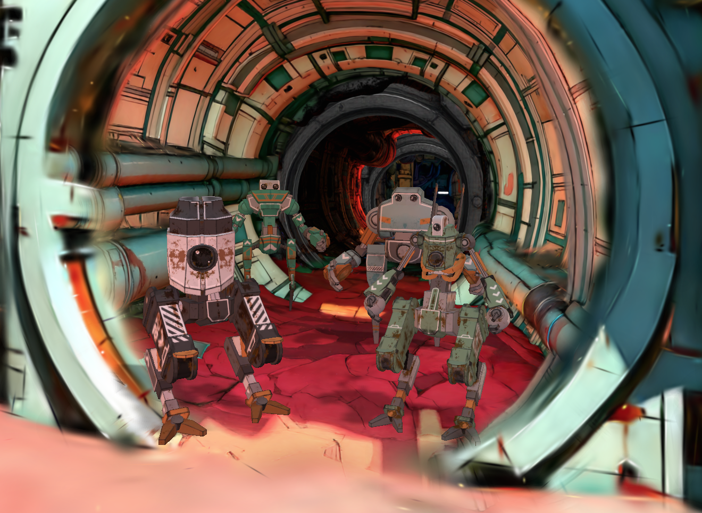

<p align="center">
  
</p>

# scifi-fetch-quest

A walkable Gaussian-splat spaceship with a tiny whodunit stapled on. The striker's keys have vanished, the crew are stranded, and they do the sensible thing: blame each other. Walk the ship in first person, talk your way down the accusation chain (George → Leela → Mike → Stan), and discover it was the **cats** all along — who promptly board the ship and fly off, leaving the crew to sheepishly apologise. Rendered with [Spark](https://github.com/sparkjsdev/spark) in the browser; also a reasonable starter for your own interactive splat worlds.

## Stack

| Layer | Library |
| --- | --- |
| Renderer | [Three.js](https://threejs.org) (`WebGLRenderer`) |
| Gaussian splats | [Spark](https://github.com/sparkjsdev/spark) (`SparkRenderer` with streaming LOD `.rad`) |
| Physics & character controller | [crashcat](https://www.npmjs.com/package/crashcat) (static triangle-mesh collider, kinematic character controller, raycasts) |
| Navigation | [navcat](https://www.npmjs.com/package/navcat) (solo navmesh and crowd steering/avoidance) |
| Math | [mathcat](https://www.npmjs.com/package/mathcat) |
| Binary asset packing | [packcat](https://www.npmjs.com/package/packcat) |
| Asset tooling | [glTF-Transform](https://gltf-transform.dev) (collider/navmesh extraction), [Playwright](https://playwright.dev) (headed light-probe bake) |
| Language and build | TypeScript with [Vite](https://vite.dev) |
| Lint and format | [Biome](https://biomejs.dev) |

## Quick start

### Requirements

- Node.js 24+ (see `.nvmrc`).
- pnpm (the repo ships a `pnpm-lock.yaml`).
- Google Chrome, only for re-baking the light probes (`pnpm bake:probes` drives real headed Chrome). Not needed to run the scene.

### Install and run

```bash
pnpm install
pnpm dev          # http://localhost:5173
```

### Build for production

```bash
pnpm build        # tsc + vite build, output to dist/
pnpm preview      # serve the production build locally
```

## Controls

- **Move**: `W` `A` `S` `D` / arrow keys
- **Look**: mouse (click the canvas to capture the pointer)
- **Jump**: `Space` · **Sprint**: hold `Shift`
- **Talk**: aim at a crew member or cat; a "talk" card appears by the crosshair when you're in range — **left-click** to start.
  - Crew responses use a **radial wheel**: flick the mouse toward a reply and click (or press `1`–`3`). Pointer lock stays put.
  - Cats just play dumb (`meow?`) until the reveal.
- **Objective**: a marker floats over your current target with the distance, and a chevron ribbon on the floor points the way.
- **Debug panel**: backtick (`` ` ``)

## The game

A short "Where Are the Keys?" quest. Each crew member you confront blames the next and joins a little conga line trailing behind you, until Stan's security footage names the real culprit: the cats loitering by the ship. Confront them, they gloat, the whole mob leaps aboard the striker and launches — then the crew apologise to each other in the aftermath. The whole thing is data-driven in [`src/quest.ts`](src/quest.ts), so the accusation chain and dialogue are easy to retune.

## How it works

A Gaussian splat is only visuals: a cloud of coloured blobs, with no floor, walls, or sense of which blobs are solid. Everything interactive comes from invisible data aligned with the splat.

- **Collider** (`src/collider-load.ts`, `src/physics.ts`). A hand-authored triangle mesh of the hull and floors (`scifi_world_collider.glb`), loaded at runtime. [crashcat](https://www.npmjs.com/package/crashcat) uses it for the player's swept-capsule collisions, the interaction ray, and grounding raycasts — and it doubles as the shadow receiver.
- **Character controller** (`src/character.ts`, `src/controls.ts`). A crashcat kinematic capsule with Quake-style movement (ground friction, air-strafe, bunny-hop), pointer-lock mouse look, and a subtle view bob.
- **Navmesh + crowd** (`src/navigation.ts`, `src/characters.ts`, `src/cats.ts`). The crew *and* the cats are [navcat](https://www.npmjs.com/package/navcat) crowd agents that path around the ship and avoid each other; the player is a target-less proxy agent pinned to your feet so they steer around you too.
- **Cast** (`src/character-visuals.ts`, `src/cats.ts`). Animated models that blend idle/walk by speed, turn to face you while talking, and — for the cats — wander, meow, and hop into the ship at the finale.
- **Dialogue** (`src/dialogue.ts`, `src/voice.ts`). The radial response wheel plus an Animal-Crossing-style "animalese" typewriter voice (pure Web Audio, no samples).
- **HUD** (`src/nameplate.ts`, `src/objective-marker.ts`, `src/path-trail.ts`, `src/quest-hud.ts`). The talk prompt, the world-space objective marker, the floor chevron ribbon, and the objective line.
- **Shadows** (`src/shadows.ts`). A directional sun casts the crew + cats onto the collider mesh, reused as an invisible `ShadowMaterial` receiver so shadows land on the real floor and follow its shape.
- **Lighting** (`src/light-probes.ts`). The cast is lit by a baked order-2 SH light-probe *volume* sampled per fragment, so their colour varies as they move through the ship.

The collider, navmesh, and probe grid are "baked": generated once, offline, then loaded directly. A loading overlay stays up until enough of the splat is on screen (it counts drawn splats rather than waiting a fixed time).

## Asset pipeline

Everything the browser loads is prepared offline, so there's no heavy parsing at runtime. The hand-authored collision mesh is the shared source for both the runtime collider and the navmesh; the light-probe grid is baked from the ship splat itself.

```bash
pnpm build:navmesh    # public/navmesh.json        from the collider .glb
pnpm bake:probes      # public/light-probes.json   from the ship splat (via src/bake.ts)
pnpm build:lod        # public/<name>-lod.rad      streaming-LOD splat from the source .spz
```

| Script | Input | Output | Used by |
| --- | --- | --- | --- |
| [`scripts/build-navmesh.ts`](scripts/build-navmesh.ts) | `scifi_world_collider.glb` | `public/navmesh.json` | `src/navigation.ts` |
| [`scripts/bake-probes.mjs`](scripts/bake-probes.mjs) | ship splat (`bake.html` → `src/bake.ts`) | `public/light-probes.json` | `src/light-probes.ts` |
| [`scripts/build-lod.sh`](scripts/build-lod.sh) | source `.spz` | `public/<name>-lod.rad` | `src/index.ts` |

`build-navmesh` flood-fill-prunes from a seed point, so only the one connected walkable volume the player occupies is saved (disconnected islands and the exterior hull are dropped). The probe bake spins up the Vite dev server and opens `bake.html` in **real headed Chrome** — Spark needs a real GPU, and headless Chromium renders splats faithlessly — then captures the SH grid and writes the JSON. Re-run it when the ship splat or the `PROBE_*` config in `src/scene.ts` changes.

> The runtime splat (`public/<name>-lod.rad`) is built from the source `.spz` with Spark's Rust `build-lod` tool, which ships in the Spark *source* repo, not the npm package. Set `SPARK_REPO` if your Spark checkout isn't at `~/Development/spark-gpu`. The prebuilt `.rad` ships in `public/`.

## Scene configuration

Everything specific to *this* ship (asset URLs, camera/spawn positions, cast anchors, the striker/cat placement, the light-probe grid extents, gravity, lighting intensities) lives in [`src/scene.ts`](src/scene.ts), so swapping in a new world is largely a one-file edit. Per-system "feel" constants (movement, bob, follow distances, dialogue timing) stay in their own modules.

## Debug panel

Press backtick (`` ` ``) for a debug overlay with a live readout (camera/feet position, splat counts) and toggles:

- **orbit camera**: swap the first-person controller for an orbit camera
- **collider / navmesh debug**: the collision mesh and the walkable navmesh
- **light probes**: the baked probe grid, each cell an SH-shaded gizmo sphere
- **crowd debug**: a cylinder per crowd agent (crew, cats, and the player proxy)
- **lod scale**: a slider on the splat level-of-detail budget
- **skip to stage**: jump the quest to any stage (george → … → cat → closed) to test dialogue and the finale

## Deploy (GitHub Pages)

`vite.config.ts` reads a `BASE_PATH` env var (default `/`). To serve under a project subpath, build with it set (e.g. `BASE_PATH=/scifi-fetch-quest/ pnpm build`) so the app and its absolute asset URLs (via `import.meta.env.BASE_URL` in `src/scene.ts`) resolve correctly. Update the value if you rename the repo.

## License

MIT.
